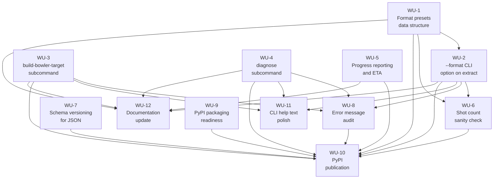

# turkey.club routinely usable release — plan

> Requirements: [turkey.club routinely usable release — requirements](../requirements/2026-08-26-routinely-usable-release.md) — status: ready
> Goal: [turkey.club routinely usable release](../goals/2026-08-26-routinely-usable-release.md) — status: ready

## Summary

| Phase | Count |
| ----- | ----- |
| v0    | 12    |
| later | 0     |

Covered: 11/16
Uncovered: FR-7, FR-8, FR-9, FR-10, FR-11 (all Won't/later — excluded by design)

## Architecture & technology decisions

### AD-1: Format preset storage location
**Options considered:**
- `FORMAT_PRESETS` dict in `config.py` — follows existing pattern where all configuration dataclasses live in `config.py`
- New `presets.py` module — separates format knowledge from core config
- External TOML/JSON file — user-extensible but adds a file-discovery problem
**Chosen:** `FORMAT_PRESETS` dict in `config.py`
**Rationale:** `config.py` already holds `SegmentationParameters`, `VenueCalibration`, `LaneCalibration`, `BowlerTarget`. Format presets are configuration. A new module is not warranted for a single dict. External files add complexity without clear benefit — the preset list is stable and code-owned.
**Affects:** WU-1, WU-2

### AD-2: Progress reporting placement
**Options considered:**
- Inline in `pipeline.py` `_extract_shots_probe` and `_extract_shots_linear` — direct access to frame counters and timing
- Separate `progress.py` module with a `ProgressTracker` class — cleaner separation, reusable
**Chosen:** Inline in `pipeline.py` with a lightweight `_ProgressTracker` helper class defined in the same module
**Rationale:** The progress data (frame count, fps, per-frame YOLO cost) is already local to the pipeline functions. A standalone module would need every counter threaded through as arguments. A small helper class in `pipeline.py` keeps the data close without cluttering the loop bodies.
**Affects:** WU-5

### AD-3: Error audit approach
**Options considered:**
- Incremental: improve error messages as each new subcommand is built, then a final sweep
- Big-bang: one dedicated work unit that audits and rewrites all error paths at once
**Chosen:** Incremental build + final sweep
**Rationale:** New subcommands (WU-3, WU-4) should ship with NFR-1-quality error messages from the start. A final sweep catches the existing `extract`, `calibrate`, `preview`, `fetch`, `merge` paths that predate the requirement.
**Affects:** WU-3, WU-4, WU-8

### AD-4: PyPI publication mechanism
**Options considered:**
- Manual `twine upload` from a local build — simple, no CI dependency, author-controlled
- GitHub Actions workflow triggered on tag push — automated, repeatable, but adds CI setup
**Chosen:** Manual `twine upload` from a local build
**Rationale:** Publication is a low-frequency, single-author event (initial publish + occasional updates). Manual `twine upload` keeps PyPI token local, avoids CI secrets management, and is fully sufficient. A GitHub Actions publish workflow can be added later if cadence justifies it.
**Affects:** WU-10

### AD-5: `build-bowler-target` reference/lane pairing convention
**Options considered:**
- Ordered pairing: `--reference img1 --reference img2 --lane left --lane right` (matched by position)
- Single `--reference` broadcasts to all `--lane` values; otherwise counts must match
**Chosen:** Single `--reference` broadcasts to all `--lane` values; otherwise counts must match — same convention as the existing `calibrate` command's `--frame`/`--lane` pairing
**Rationale:** Consistency with `calibrate` reduces cognitive load. The broadcast behavior (one image for all lanes) is the common case; explicit pairing handles the rest.
**Affects:** WU-3

### AD-6: Cross-platform testing approach
**Options considered:**
- GitHub Actions matrix (ubuntu, macos, windows) on every push — catches platform-specific issues early
- Manual testing on all three platforms before PyPI publish — lower overhead, higher risk
- GitHub Actions for unit/integration tests + manual end-to-end on all three platforms before publish
**Chosen:** Hybrid — GitHub Actions runs `pytest tests/` on ubuntu, macos, and windows on every push; manual end-to-end testing on all three platforms before the PyPI publish
**Rationale:** turkey.club is a public repo on a free personal GitHub account — Actions minutes are unlimited for public repos. Smoke tests on all three OSes catch import/path/encoding differences automatically at zero cost. End-to-end tests (requiring ffmpeg, YOLO model download, and a test video) stay manual — too heavy for CI, too infrequent to justify fixture management.
**Affects:** WU-9, WU-10

## Test strategy

**Approach:** Unit tests for pure-logic components (preset resolution, schema versioning, shot count validation), CLI integration tests via `typer.testing.CliRunner` for new subcommands, manual end-to-end testing against real bowling video for pipeline changes.

**Infrastructure:** `pytest` (already a dev dependency). No additional test rigs needed. CLI tests use `CliRunner` (already demonstrated in `tests/test_smoke.py`). Pipeline-level progress reporting is tested manually against a real video since mocking YOLO + ffmpeg + OpenCV at that level is not worth the fixture cost.

**Coverage targets:**
- Testable automatically: preset lookup and override logic, schema version load/save round-trip, shot count range validation, CLI `--help` output for new subcommands, `build-bowler-target` and `diagnose` argument validation and error paths
- Manual only: end-to-end extract with `--format`, progress ETA accuracy, cross-platform `pip install`, interactive `calibrate` GUI, visual `preview` output

## Work breakdown

### Phase: v0

#### WU-1: Format presets data structure
**Statement:** A `FORMAT_PRESETS` dictionary in `config.py` defines all eleven bowling format presets, each bundling probe interval, lane policy, and expected shot count range per the format taxonomy.
**Implements requirements:** FR-1
**Depends on:** —
**Definition of done:**
- `FORMAT_PRESETS` dict exists in `src/turkey_club/config.py` with keys: `pba-qualifying`, `pba-match-play`, `doubles`, `scotch-doubles`, `baker`, `baker-half`, `baker-double`, `league`, `singles-practice`, `multi-bowler-practice`, `open`
- Each entry has `probe_interval_seconds`, `lane_policy` (`"cross-lane"` | `"single-lane"`), `expected_shot_range` (tuple of min, max)
- Values match the format taxonomy in `thoughts/shared/memory/project_bowling_format_taxonomy.md`
- Unit test verifies all eleven keys are present and each has the required fields

#### WU-2: `--format` CLI option on `extract`
**Statement:** The `extract` command accepts `--format <preset>` to bundle per-format defaults, with individual flags overriding preset values, and Baker variants requiring `--bowler-lane`.
**Implements requirements:** FR-1
**Depends on:** WU-1
**Definition of done:**
- `--format` option added to `extract` in `cli.py`
- When `--format` is specified, its `probe_interval_seconds` and `lane_policy` are used as defaults
- `--probe-interval` and `--bowler-lane` override the preset when explicitly passed
- Baker variants (`baker`, `baker-half`, `baker-double`) error with a clear message when `--bowler-lane` is absent
- `--format` is optional; omitting it preserves current behavior
- `turkey-club extract --help` lists all preset names
- Invalid preset name produces an error listing valid presets
- CLI integration test via `CliRunner` verifies preset resolution and Baker validation

#### WU-3: `build-bowler-target` CLI subcommand
**Statement:** A new `build-bowler-target` subcommand exposes `identify.build_bowler_target_from_references` as a proper CLI command, removing the need for a custom Python script.
**Implements requirements:** FR-2
**Depends on:** —
**Definition of done:**
- `build-bowler-target` subcommand registered in `cli.py`
- Accepts `--name`, `--calibration`, `--reference` (repeatable), `--lane` (repeatable), `--samples-per-image` (default 2000), `--out`
- Single `--reference` broadcasts to all `--lane` values; otherwise counts must match (mirrors `calibrate`'s convention)
- Produces a valid `BowlerTarget` JSON
- Error messages follow NFR-1 for: no person detected in approach zone, image not found, lane name mismatch
- `build-bowler-target` appears in `turkey-club --help`
- CLI integration test verifies argument validation and error paths

#### WU-4: `diagnose` CLI subcommand
**Statement:** A new `diagnose` subcommand lets the user see bowler-confidence scores on sample frames before committing to a full extract run, enabling troubleshooting of identification at new venues.
**Implements requirements:** FR-12
**Depends on:** —
**Definition of done:**
- `diagnose` subcommand registered in `cli.py`
- Accepts `--video`, `--bowler-target`, `--calibration`, optionally `--frames` (default 10) and a timestamp or frame range
- Samples N evenly-spaced frames across the video (or within the specified range)
- For each sampled frame, reports per-person confidence scores grouped by lane, with the highest-confidence match highlighted
- Prints a summary: "target bowler detected in N/M sampled frames at confidence X.XX-Y.YY" with guidance if scores are borderline (near 0.30)
- Text output to stdout
- `diagnose` appears in `turkey-club --help`

#### WU-5: Progress reporting with upfront time estimate and ongoing ETA
**Statement:** The `extract` command reports an upfront estimated runtime before main processing begins and ongoing ETA updates as the run progresses, so users know the tool is working and how long it will take.
**Implements requirements:** FR-4
**Depends on:** —
**Definition of done:**
- Before the main processing loop, the pipeline times a small sample of frames (e.g., 5-10 frames) to measure per-frame YOLO cost on current hardware
- Prints an upfront estimate within the first 60 seconds: "Estimated runtime: ~XX minutes at current speed"
- Ongoing progress lines in both `_extract_shots_probe` and `_extract_shots_linear` include a refining ETA
- ETA is within +/-30% of actual runtime by the halfway point of the run
- Existing per-probe and per-shot log lines are preserved; ETA is additive
- All progress `print()` calls use `flush=True`

#### WU-6: Format-aware shot count sanity check
**Statement:** After extraction completes with `--format`, the pipeline compares the number of detected shots against the format's expected range and warns if the count falls outside it.
**Implements requirements:** FR-6
**Depends on:** WU-1, WU-2
**Definition of done:**
- Warning fires when the shot count is outside the preset's expected range
- Warning text includes expected range and actual count: "Warning: found N shots but <preset> expects X-Y. Possible missed shots or wrong format."
- No warning when count is within range
- Warning is advisory only — no hard failure, no non-zero exit code
- Unit test verifies warning logic with edge cases (within range, below, above)

#### WU-7: Schema versioning for JSON artifacts
**Statement:** `VenueCalibration` and `BowlerTarget` JSON files include a `version` field for forward compatibility, with backward-compatible loading of version-less existing files.
**Implements requirements:** DR-1
**Depends on:** —
**Definition of done:**
- `VenueCalibration.save` and `BowlerTarget.save` include `"version": 1` in output JSON
- `VenueCalibration.load` and `BowlerTarget.load` check the version field; missing version treated as version 1
- Loading a file with version > 1 raises a clear error naming expected version and how to regenerate
- Existing calibration and bowler-target files (version field absent) continue to load
- Unit tests verify: save includes version, load without version succeeds, load with version 2 fails with clear error

#### WU-8: Error message audit and improvement
**Statement:** Every user-facing error path across all subcommands provides step-by-step diagnostic and corrective instructions, or explicitly declares the scenario unsupported.
**Implements requirements:** NFR-1
**Depends on:** WU-2, WU-3, WU-4
**Definition of done:**
- Missing ffmpeg: error names the tool, provides platform-appropriate install command, tells user to reopen shell
- Missing yt-dlp: error names the tool, provides install command, names what the user was trying to do
- Missing/malformed calibration/bowler-target JSON: error names the file, states what is wrong, provides the exact command to regenerate
- No person detected in reference image: numbered diagnostic sequence
- Invalid `--format` preset: error lists all valid presets with one-line descriptions
- Schema version mismatch: error names expected version, version found, exact command to regenerate
- Unsupported scenario: explicitly declares unsupported and names the constraint
- Audit: every `raise RuntimeError(...)`, `raise ValueError(...)`, and `typer.Exit(code=2)` includes either corrective instructions or an explicit unsupported declaration

#### WU-9: PyPI packaging readiness
**Statement:** The package is ready for cross-platform `pip install turkey-club` — `mediapipe` removed, licenses verified, `pyproject.toml` metadata complete, and the package builds cleanly.
**Implements requirements:** FR-3
**Depends on:** —
**Definition of done:**
- `mediapipe` removed from `dependencies` in `pyproject.toml` (confirmed: no imports in source code)
- All runtime dependency licenses verified MIT-compatible (MIT, BSD, Apache 2.0, PSF, ISC)
- `pyproject.toml` metadata complete: `authors`, `license`, `readme`, `urls` (Homepage, Repository, Issues), `classifiers` (Development Status, License, Programming Language, Topic)
- `pip install turkey-club` in a fresh virtual environment on Windows installs the tool and exposes the `turkey-club` entry point
- `turkey-club --help` works after fresh install
- Version in `pyproject.toml` matches `src/turkey_club/__init__.py`

#### WU-10: PyPI publication
**Statement:** The package is built and uploaded to PyPI so that `pip install turkey-club` resolves from the public index.
**Implements requirements:** OR-1
**Depends on:** WU-9, WU-1, WU-2, WU-3, WU-4, WU-5, WU-6, WU-7, WU-8
**Definition of done:**
- Package is published on PyPI under the name `turkey-club`
- `pip install turkey-club` in a fresh virtual environment on each platform succeeds
- Published package version matches `pyproject.toml` and `src/turkey_club/__init__.py`
- A repeatable publication mechanism exists (manual `twine upload` or CI workflow — per AD-4)

#### WU-11: CLI help text polish
**Statement:** Every subcommand's `--help` output is self-documenting, with all options described and special values enumerated, using consistent terminology.
**Implements requirements:** UX-1
**Depends on:** WU-2, WU-3, WU-4
**Definition of done:**
- `turkey-club --help` lists all subcommands with one-line descriptions
- `turkey-club extract --help` lists all available `--format` preset names
- `turkey-club build-bowler-target --help` documents the `--reference`/`--lane` pairing convention
- `turkey-club diagnose --help` documents output interpretation and confidence scores
- Consistent terminology across all subcommands
- CLI test verifies all subcommands appear in top-level `--help`

#### WU-12: Documentation update
**Statement:** User documentation is updated with explicit dependency isolation guidance, a format preset reference, a start-to-finish tutorial using all new subcommands, and all stale references corrected.
**Implements requirements:** FR-5
**Depends on:** WU-1, WU-2, WU-3, WU-4, WU-5
**Definition of done:**
- `docs/user/installation.md` updated with explicit venv/virtualenv instructions per platform (Windows, macOS, Linux) as the default installation path
- `docs/user/installation.md` removes `mediapipe` from the dependency table
- A format preset reference table documents each `--format` preset's bundled defaults
- Start-to-finish tutorial walks a new user from "I have a bowling video" to "I have per-shot clips," using `build-bowler-target` instead of the manual Python script
- Existing documentation references to planned/unimplemented features updated to reflect v0 state
- `<repo-url>` placeholders replaced with `https://github.com/autopulous/turkey.club`
- README updated: format presets and `build-bowler-target` moved from "planned" to "implemented," `build-bowler-target` tutorial replaces the Python script section

## Dependency graph

**Critical path:** WU-1 → WU-2 → WU-8 → WU-10

Note: WU-3, WU-4, WU-5, WU-7, WU-9 are all independent of each other and can run in parallel with the WU-1 → WU-2 chain.

## Risk register

| Risk | Likelihood | Impact | Mitigation / Accept |
| ---- | ---------- | ------ | ------------------- |
| Identification fragility across venues (from goal) | M | H | FR-12 (`diagnose` subcommand) provides diagnostic tooling; documentation covers threshold tuning. Accept residual risk — adaptive thresholding is a later enhancement |
| Dependency installation complexity (from goal) | H | M | FR-5 (documentation with per-platform venv/virtualenv guidance), FR-3 (mediapipe removal reduces install size). Accept residual risk — the stack is inherently heavy |
| User impatience (from goal) | H | M | FR-4 (progress reporting with upfront estimate and ongoing ETA). Accept residual risk — CPU YOLO inference speed is a hardware constraint |
| PyPI name `turkey-club` may already be claimed | — | — | **Resolved:** confirmed available as of 2026-08-26 (PyPI JSON API returned 404) |
| Runtime dependency has GPL/LGPL license | L | H | FR-3 acceptance criteria require license audit. Known runtime deps (typer, opencv-python, numpy, easyocr, ultralytics, yt-dlp) are MIT/BSD/Apache/AGPL-exception. Audit in WU-9 before publish |
| ETA accuracy on heterogeneous hardware | M | L | FR-4 calibrates per-frame cost on current hardware. Accept — +/-30% by halfway point is the requirement; worse accuracy early is expected |
| Baker lane-restriction logic introduces regressions in non-Baker extract | L | M | WU-2 preserves existing behavior when `--format` is omitted. Smoke tests confirm no-format extract still works |

## Rollout plan

- **Release vehicle:** PyPI package (`pip install turkey-club`), versioned at `0.2.0` (bump from current `0.1.0` to signal the routinely-usable release)
- **Migration steps:**
  1. Existing users: `pip install --upgrade turkey-club` picks up all new subcommands and `--format` option
  2. Existing `VenueCalibration` and `BowlerTarget` JSON files (no version field) load without error (backward compatible per WU-7)
  3. Existing `build_bowler_target.py` scripts continue to work (library function unchanged); the new CLI subcommand is additive
- **Dark launch / canary:** N/A — single-user open-source tool; no staged rollout
- **Rollback plan:** `pip install turkey-club==0.1.0` reverts to the pre-routinely-usable version. JSON files created with version 1 are backward-compatible with 0.1.0's version-less loader
- **Deprecations:** The manual Python script approach to building bowler targets is superseded by `build-bowler-target` subcommand. The script remains functional (library API unchanged) but documentation pivots to the CLI path
- **Communications:** GitHub release notes on the `0.2.0` tag; README updated to reflect v0 feature set

## Restatement

The plan delivers the routinely usable release through 12 work units, all v0 phase. Four independent starting points run in parallel: format presets data structure (WU-1), `build-bowler-target` subcommand (WU-3), `diagnose` subcommand (WU-4), progress reporting (WU-5), schema versioning (WU-7), and PyPI packaging readiness (WU-9). The format presets data feeds into the `--format` CLI option on `extract` (WU-2), which together with the new subcommands feeds the format-aware shot count sanity check (WU-6), the error message audit (WU-8), and CLI help text polish (WU-11). Everything converges on documentation (WU-12) and PyPI publication (WU-10) as terminal units. Format presets are a dict in `config.py` (AD-1); progress reporting is a lightweight helper in `pipeline.py` (AD-2); error messages are built to NFR-1 quality incrementally in each new subcommand then swept across existing paths (AD-3); the `build-bowler-target` reference/lane pairing mirrors `calibrate`'s existing convention (AD-5). Publication is manual `twine upload` (AD-4). Cross-platform testing is hybrid — GitHub Actions runs smoke tests on ubuntu, macOS, and Windows on every push (free for public repos), with manual end-to-end testing on all three platforms before the PyPI publish (AD-6). The PyPI name `turkey-club` is confirmed available. `mediapipe` is dropped (no imports in source), `easyocr` stays (negligible marginal cost with torch present). The value is in the output — shot clips, efficiently obtained — not the chrome.
